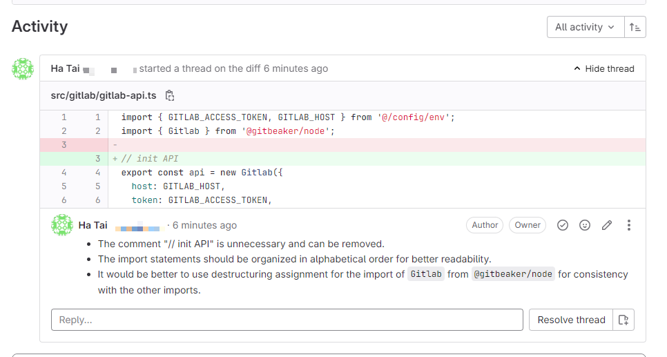

# @hataiit9x/gemini-review-code

[](https://badge.fury.io/js/%40hataiit9x%2Freview-code-ai)
[](https://opensource.org/licenses/MIT)

## Summary



`@hataiit9x/gemini-review-code` It is a small tool used for code review in GitLab Merge Requests. It supports calling the GitLab API for private 
deployment and uses the Gemini AI API to obtain review results. Please note that when using it, ensure compliance with company regulations. 😉


## Features

- 🛠️ Support configuration GitLab API address
- ⚙️ Support configuration Gemini API Key to implement load balancing of interface calls (multiple Keys are separated by commas)
- 📦 Support configuration Gemini custom model ID
- 📦 Support configuration GitLab Project ID
- 📦 Support configuration GitLab Merge Request ID
- 🚀 Support running in CI/CD
- 🚦 Automatically wait and try again when the rate limit is exceeded
- 💬 The review results are appended to the location of the corresponding code block in the form of comments


## Install

```sh
npm i @hataiit9x/gemini-review-code
`````

## Use

### Use via shell script

```shell
Usage: gemini-review-code [options]
Options:
  -g, --gitlab-api-url <string>       GitLab API URL (default: " https://gitlab.com/api/v4")
  -t, --gitlab-access-token <string>  GitLab Access Token
  -a, --api-key <string>              Gemini API Key
  -p, --project-id <number>           GitLab Project ID
  -m, --merge-request-id <string>     GitLab Merge Request ID
  -c, --custom-model <string>         Custom Model ID, (default: "gemini-1.5-flash")
  -h, --help                          display help for command
```

Example:

```sh
gemini-review-code -g https://gitlab.com/api/v4 -t glpat-xxxxxxx -a AIzaSyAYNxxxxxxx,AIzaSyAYNxxxxxxx -p 1 -c gpt-3.5-turbo 432288 -m 8
```

### Use in CI

Set the `GITLAB_TOKEN` and `CHATGPT_KEY` variables in GitLab CI/CD, `.gitlab-ci.yml` is as follows:

```yml
stages:
  - merge-request

Code Review:
  stage: merge-request  
  image: node:16
  script:
    - npm i @hataiit9x/gemini-review-code -g
    - gemini-review-code -t "$GITLAB_TOKEN" -a "$API_KEY" -c "$CUSTOM_MODELS" -p "$CI_MERGE_REQUEST_PROJECT_ID" -m "$CI_MERGE_REQUEST_IID"
  only:
    - merge_requests
  when: on_success
```

## contribute
Welcome to contribute code, ask questions and suggestions! 👏

## License
This project is based on the MIT license. See the LICENSE file for details. 📜
